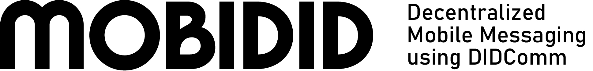

This is the go mediator for mobile messaging using DIDComm. It can be used together with
the [mobile client](https://git.snet.tu-berlin.de/blockchain/idunion-didcomm-messaging) to send DIDComm messages with other agents.

The project uses [Aries-framework-go](https://github.com/hyperledger/aries-framework-go) for all DIDComm interactions.


## Run Instructions 

### Prerequisites
- Golang >= 1.16

### Run the mediator locally
To run the mediator first use:
```
go mod tidy
```
And then run:
```
go run main.go
```

## Aries-framework-go

This project currently uses the framework status of August 12th, 2022 (v0.1.9-0.20220816070605-5fa4db149935). To update run: 
```
go get github.com/hyperledger/aries-framework-go@main
```
Or specify the exact version. 